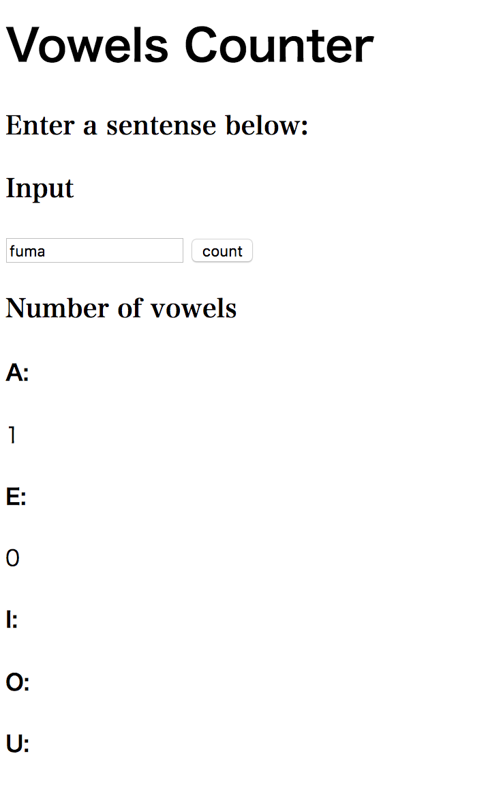

# Question2 #
## Visual design ##


## HTML, CSS code ##
```.py
<!DOCTYPE html>
<html lang="en">
<head>
    <meta charset="UTF-8">
    <title>Question2</title>
    <style>
       .serif {
           font-family: Serif;
       }
        #h1 {
            font-weight: bold;
            font-family: Helvetica,serif;
        }

    </style>
</head>
<body>
    <h1>Vowels Counter</h1>
    <h3 class="serif">Enter a sentense below:</h3>
    <h3 class="serif"><strong>Input</strong></h3>
    <input type="text" id="input_message" value="">
    <input type="button" onclick="func2()" value="count">
    <h3 class="serif">Number of vowels</h3>
    <h4>A:</h4><div id="output_a"></div>
    <h4>E:</h4><div id="output_e"></div>
    <h4>I:</h4><div id="output_i"></div>
    <h4>O:</h4><div id="output_o"></div>
    <h4>U:</h4><div id="output_u"></div>
    <div id="output_b">

    </div>

```
## javascript code ##
```.py
function func2(inp) {
        let text = document.getElementById("input_message").value; //get input
        let targetStr_a = "a";
        let targetStr_e = "e";
        let targetStr_i = "i";
        let targetStr_o = "o";
        let targetStr_u = "u";
        let v_a= (text.match(new RegExp(targetStr_a, "g"))||[]).length; //count how many "a" are included
        let v_e= (text.match(new RegExp(targetStr_e, "g"))||[]).length; //e
        let v_i= (text.match(new RegExp(targetStr_i, "g"))||[]).length; //i
        let v_o= (text.match(new RegExp(targetStr_o, "g"))||[]).length; //o
        let v_u= (text.match(new RegExp(targetStr_u, "g"))||[]).length; //u

        //print all of counts for a, e, i, o, u
        let para_a = document.createElement("P");
        para_a.innerText = v_a;
        document.getElementById("output_a").appendChild(para_a);
        let para_e = document.createElement("P");
        para_e.innerText = v_e;
        document.getElementById("output_e").appendChild(para_e);
        let para_i = document.createElement("P");
        para_a.innerText = v_i;
        document.getElementById("output_i").appendChild(para_i);
        let para_o = document.createElement("P");
        para_a.innerText = v_o;
        document.getElementById("output_o").appendChild(para_o);
        let para_u = document.createElement("P");
        para_a.innerText = v_u;
        document.getElementById("output_u").appendChild(para_u);
            }
```

Sometimes doesn't count, sometimes does.  I made such a moody code.
