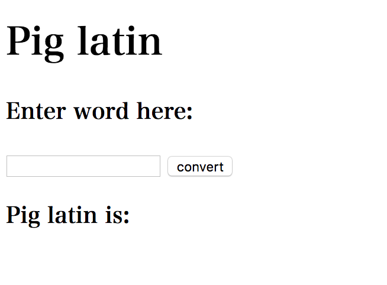

# Question 1 (pig latin) #
## Design for the page ##


## Code for pig latin ##
```
<!DOCTYPE html>
<html lang="en">
<head>
    <meta charset="UTF-8">
    <title>Question1</title>
    <style>
        #title {
            margin-left: auto;
            margin-right: auto;
            font-family: Serif;
        }
        #is {
            font-family: Serif;
        }
        #enterword {
            font-family: Serif;
        }
    </style>
</head>
<body>
    <h1 id="title">Pig latin</h1>
    <h3 id="enterword">Enter word here:</h3>
    <input type="text" id="enter_word">
    <input type="button" onclick="func1() "id="b1" value="convert">
    <h3 id="is">Pig latin is:</h3>
    <div id="output">

    </div>

</body>
<script>
    function func1(message){
         let para;
        var input_message = document.getElementById(message).value;
         var str = input_message;
         str.split('');
         var inl = [];
         inl.push(str);
         var first = str[0];
         var ostr;
        // if the first letter is vowel, print the word + -way
        if (first === "a" || "i" || "u" || "e" || "o") {
            ostr = input_message + "-way";
            para = document.createElement("P");
            para.innerText = ostr;
            document.getElementById("output").appendChild(para);
        }
        // if the first letter is not vowel, move the first letter and add -ay and print it
        else{
            var str2 = str.filter(function (value) {
                return value === str[0]
            });
            //delete first letter
            var str3 = str.shift();
            var str4 = str3.join(','); //join into a string
            ostr = str4 + str2 + "-ay";
            para = document.createElement("P");
            para.innerText = ostr;
            document.getElementById("output").appendChild(ostr);
        }
    }
</script>
</html>
```
