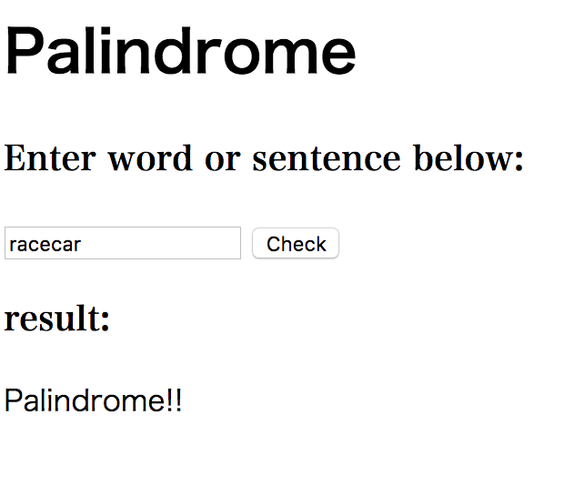

# Question3 #
## Visual Design ##


## HTML, CSS code ##
```.html
<!DOCTYPE html>
<html lang="en">
<head>
    <meta charset="UTF-8">
    <title>Question3</title>
    <style>
        #h1 {
            font-weight: bold;
        }
        .serif {
            font-family: serif;
        }
    </style>
</head>
<body>
    <h1>Palindrome</h1>
    <h3 class="serif">Enter word or sentence below:</h3>
    <input type="text" value="" id="input_message">
    <input type="button" value="Check" onclick="palindrome()">
    <h3 class="serif">result:</h3>
    <div id="output">

    </div>
</body>
```
 ## Javacript code ##
 ```.html
 <script>
    function palindrome(str) {
        let text = document.getElementById("input_message").value; //get input
        let i = text.replace(/[\W_]/g, '').toLowerCase();//remove except for letters, make them lower case

         if (i === i.split('').reverse().join('')) {

             var para_1 = document.createElement("P");
             para_1.innerText = "Palindrome!!";
             document.getElementById("output").appendChild(para_1);
             console.log("Palindrome!!");
         }
        else
            var para_2 = document.createElement("P");
            para_2.innerText = "NOT Palindrome!!";
            document.getElementById("output").appendChild(para_2);
            console.log("NOT Palindrome!!")

    }
</script>
```
 
