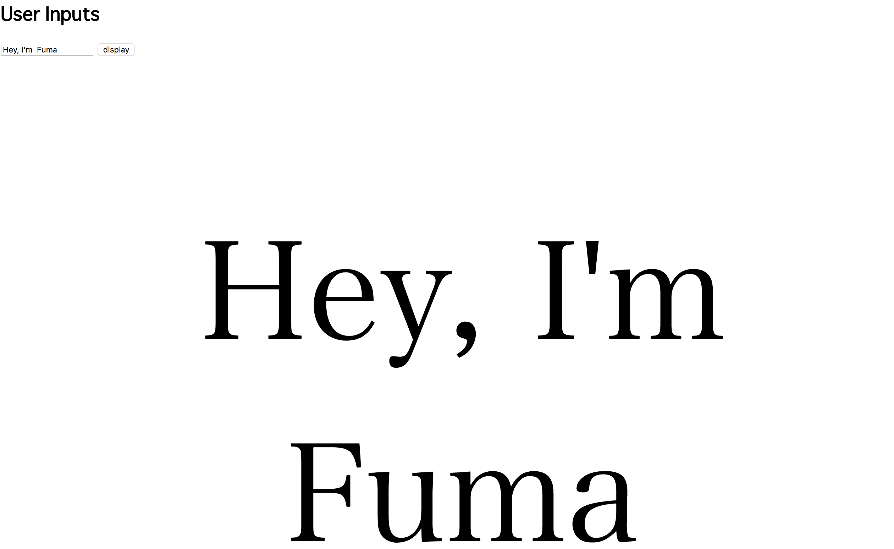

# Questioon4 #
## Visual Design ##


## HTML, CSS code ##
```.html
<!DOCTYPE html>
<html lang="en">
<head>
    <meta charset="UTF-8">
    <title>Question4</title>
    <style>
        h1 {
            font-family: monospace;
        }
        #output {
            text-align: center;
            font-family: serif;
            font-size: 190px;
        }
    </style>
</head>
<body>
    <h1>User Inputs</h1>
    <input type="text" id="input_message" value="">
    <input type="button" value="display" onclick="func3()">
    <div id="output">

    </div>
</body>
```

## Javascript code ##
```.html
<script>
    function func3() {
        let text = document.getElementById("input_message").value; //get input
        let para = document.createElement("P");
        para.innerText = text;
        document.getElementById("output").appendChild(para);
    }
</script>
```
